# Тестування працездатності системи

*Тестування на створення опитування та додавання відповідей за допомогою застосунку Postman.
Враховуючи те, що аутинтефікація не була імплементована, додаємо користувача до бази даних вручну*

# Створити опитування
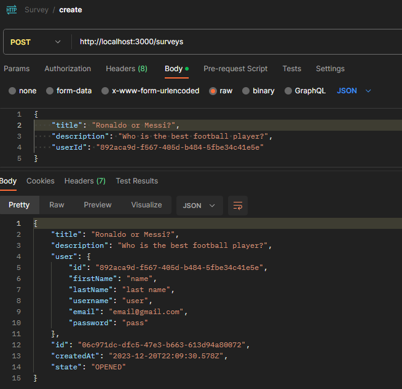

# Видалити опитування
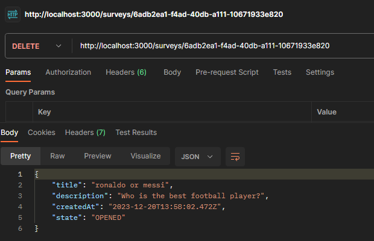

# Створити питання з текстовою відповіддю
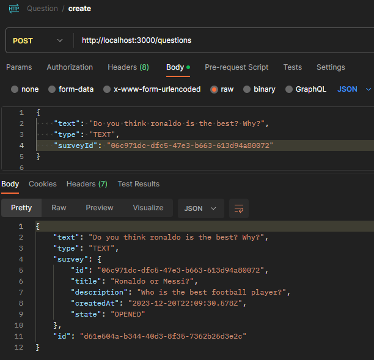

# Створити питання з опційною відповіддю
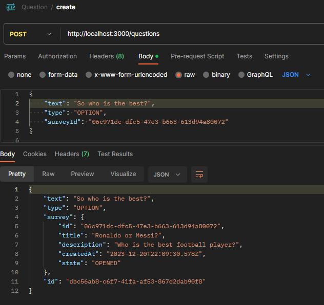

# Додати опції до створеного опційного питання
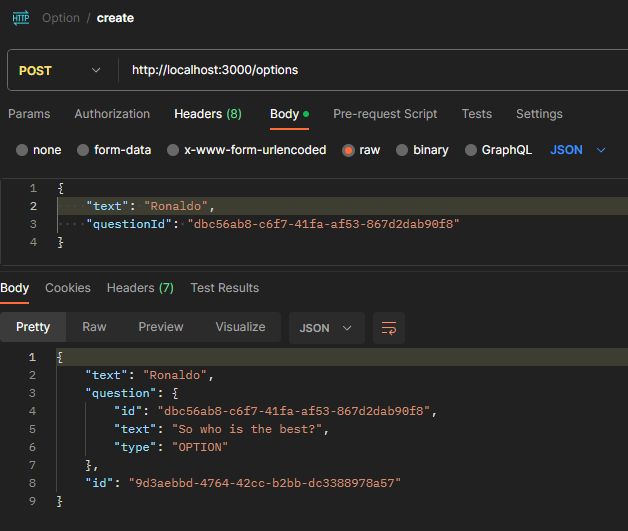
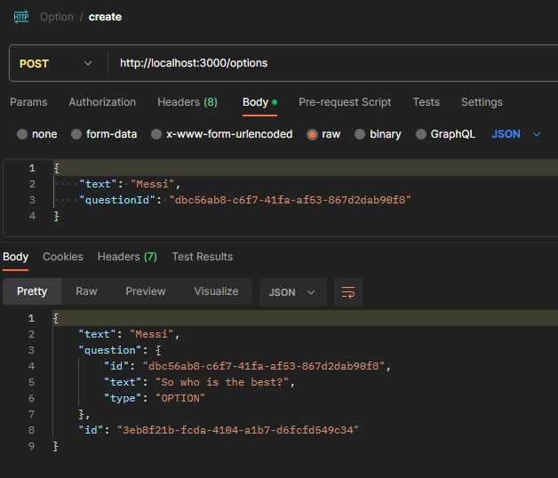

# Спроба створити відповідь з типом, що не підходить під тип питання
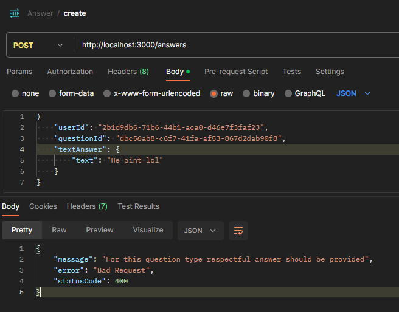

# Додати відповідь до опційного питання
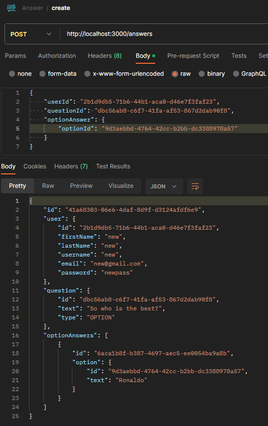

# Додати відповідь до текстового питання
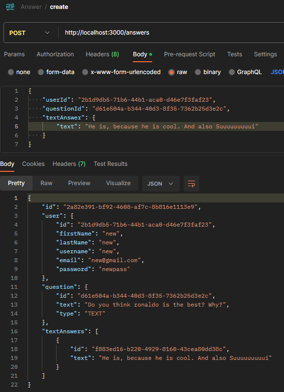

# Спроба продублювати відповідь
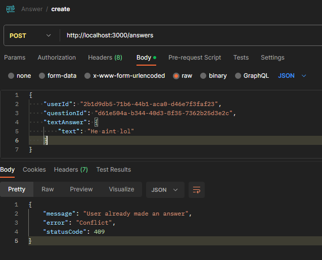

# Створити відповідь від іншого юзера до текстового питання
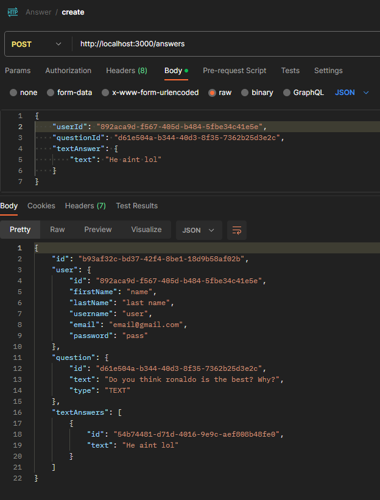

# Отримати відповіді до текстового питання від обох юзерів
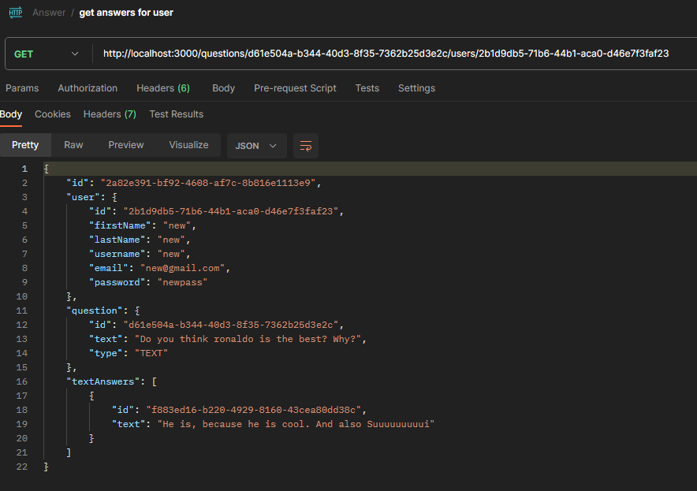
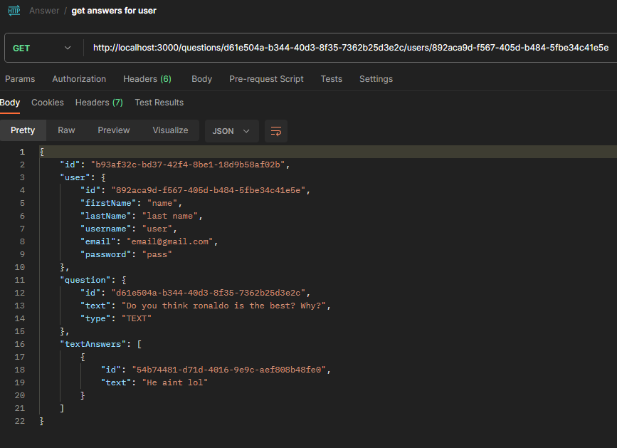

# Отримати відповіді до опційного питання від обох юзерів
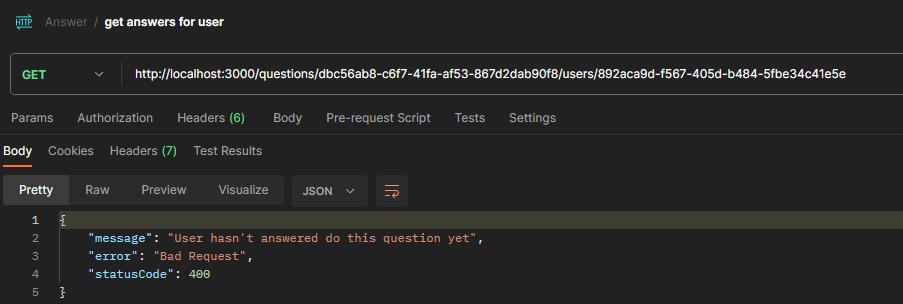
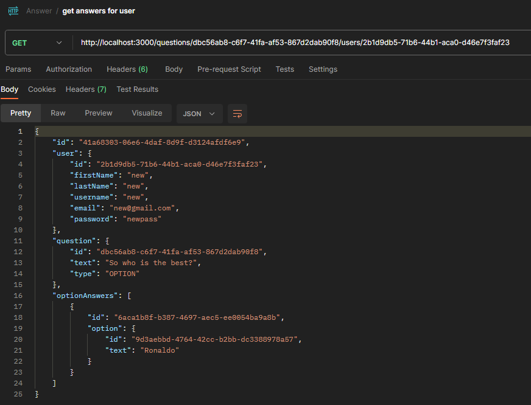
